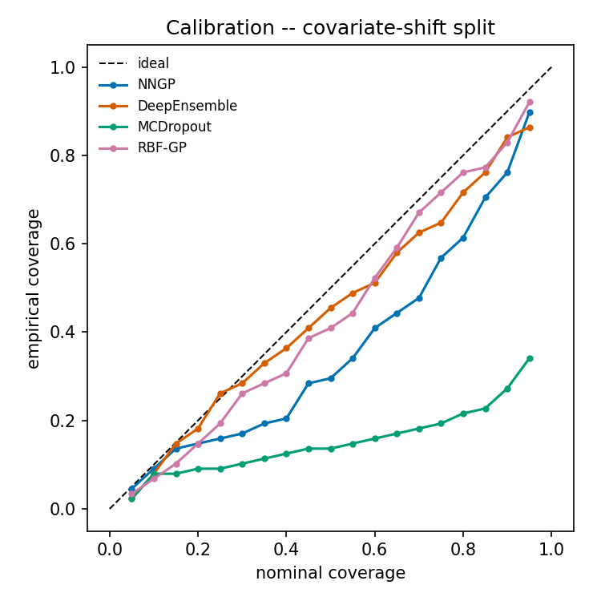
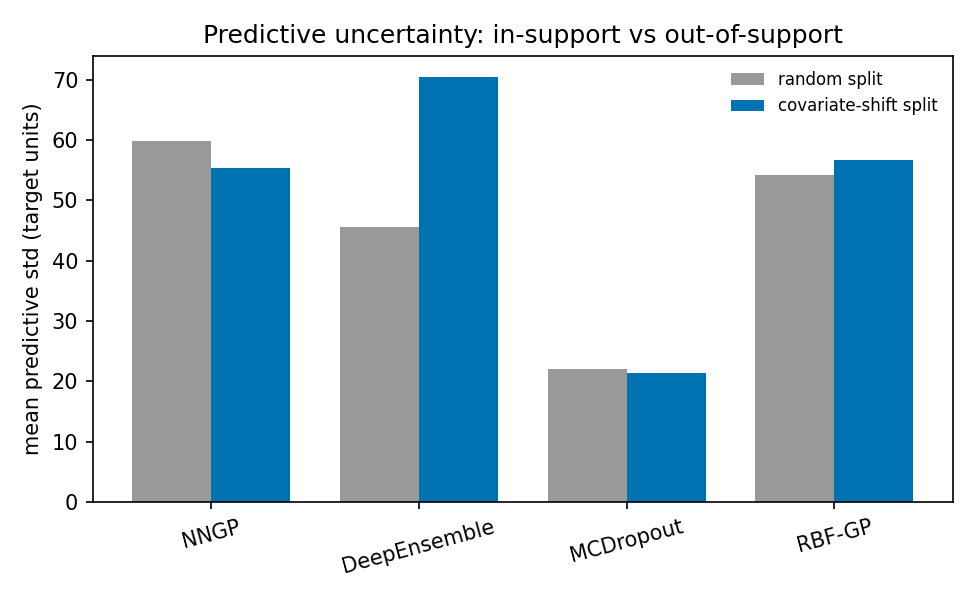

# Infinite-Width Uncertainty

**Is the uncertainty you get "for free" from an infinitely-wide neural network actually trustworthy — and does it survive when the test data drifts outside what the model was trained on?**

A compact, reproducible benchmark that treats the infinite-width limit of a neural network as an exact Gaussian process (an **NNGP**) and asks not "how accurate is it?" but "**how good is its uncertainty?**" — against three finite baselines, on a biomedical regression task, under both an i.i.d. split and a deliberate covariate-shift stress test.

---

## About

When the hidden layers of a neural network are taken to infinite width, the function it computes converges to a Gaussian process whose kernel is determined entirely by the architecture (Neal, 1996; Lee et al., 2018). That correspondence means you can skip stochastic training altogether and get a **closed-form predictive distribution** — a mean *and* a calibrated-in-principle variance — by doing exact GP inference with the network's kernel.

This project puts that promise to the test on **disease-progression regression** (scikit-learn's diabetes dataset). It compares four ways of producing predictive uncertainty:

| Model | What it is | Uncertainty source |
|---|---|---|
| **NNGP** | infinite-width fully-connected net as a GP (`neural-tangents`) | exact GP posterior variance |
| **Deep ensemble** | the finite-width counterpart: an ensemble of the *same* architecture | disagreement + predicted noise |
| **MC-dropout** | a single net with dropout left on at test time | stochastic forward passes |
| **RBF-GP** | a textbook RBF-kernel Gaussian process (`scikit-learn`) | exact GP posterior variance |

The distinguishing question — and the reason this is not "another UQ repo" — is the **covariate-shift experiment**: the models are evaluated both on a random test split *and* on a split where the entire upper tail of one clinical feature (BMI) is held out of training, so the test patients lie **outside the training support**. A method whose uncertainty is meaningful should notice; one whose uncertainty is decorative should not.

Everything is measured with the metrics that actually matter for decision-making: interval **calibration**, proper scoring rules (**NLL**, **CRPS**), and a **selective-prediction** risk–coverage curve that asks whether the model's own confidence can be used to safely defer its least-reliable predictions.

> **A note on honesty.** Every number and figure below was produced by running the code in this repository (single seed, `SEED=0`). Results are reported as measured, including where they complicate the tidy "GPs always win" story — see [Findings](#findings).

---

## Background: the NNGP correspondence in one paragraph

Place i.i.d. Gaussian priors on a network's weights and biases. For a single hidden layer, each output is a sum of many i.i.d. contributions, so by the central limit theorem the output distribution over functions tends to a Gaussian process as the width grows (Neal, 1996). Lee et al. (2018) showed this extends recursively through depth: a deep fully-connected network maps to a GP whose kernel is computed layer by layer from the nonlinearity and the prior variances. `neural-tangents` evaluates that kernel analytically for a given architecture, after which prediction is ordinary GP regression. Because it *is* GP regression, inference costs **O(n³)** in the number of training points — which is why this method belongs on small-to-moderate tabular problems, the opposite regime from the *nearest-neighbor* GP that shares the "NNGP" acronym.

---

## Project structure

```
infinite-width-uq/
├── src/iwuq/
│   ├── data.py         # diabetes loader, QSAR loader (skeleton), random + covariate-shift splits
│   ├── models.py       # NNGP, DeepEnsemble, MCDropout, RBF-GP behind one fit/predict_dist interface
│   ├── metrics.py      # RMSE, MAE, NLL, closed-form Gaussian CRPS, coverage, calibration area
│   ├── selective.py    # risk-coverage curve + AURC
│   └── plotting.py     # reliability diagrams, uncertainty-under-shift, risk-coverage figures
├── experiments/
│   ├── run_diabetes.py # the full benchmark used to produce the results below
│   └── run_qsar.py     # identical pipeline for a molecular pIC50 dataset (you supply the data)
├── notebooks/
│   └── results.ipynb   # narrated walkthrough
└── results/
    ├── figures/        # generated PNGs (committed)
    └── tables/         # generated CSV + Markdown metric tables
```

---

## Getting started

### Prerequisites

- Python ≥ 3.10
- A pinned JAX pair (see note). CPU is fine; the dataset is tiny.

> **Why JAX is pinned.** `neural-tangents 0.6.5` relies on a JAX internal (`jax.core.Jaxpr`) that was removed in later releases, so `jax`/`jaxlib` are pinned to `0.4.28`. If you upgrade JAX, neural-tangents import will break. This is documented in `requirements.txt`.

### Installation

```bash
git clone https://github.com/<your-username>/infinite-width-uq.git
cd infinite-width-uq
python -m venv .venv && source .venv/bin/activate
pip install -r requirements.txt
pip install -e .          # exposes the `iwuq` package
```

### Reproduce the results

```bash
python experiments/run_diabetes.py
```

This fits all four models on both splits, prints the metric tables, and writes figures to `results/figures/` and tables to `results/tables/`. On a laptop CPU it finishes in a couple of minutes (the neural baselines dominate; the two GPs are near-instant).

Or step through it interactively:

```bash
jupyter notebook notebooks/results.ipynb
```

---

## Usage

Every model shares one interface, so swapping methods or datasets is a one-line change:

```python
from iwuq import data, metrics
from iwuq.models import NNGPRegressor

ds = data.load_diabetes_dataset()
split = data.covariate_shift_split(ds, feature="bmi", test_frac=0.2)

model = NNGPRegressor(depth=2, activation="erf").fit(split.X_train, split.y_train)
mean, std = model.predict_dist(split.X_test)        # predictive mean and std

print(metrics.evaluate(split.y_test, mean, std))     # RMSE, NLL, CRPS, coverage, ...
```

The NNGP's signal-variance and observation-noise are selected by **maximising the GP log marginal likelihood** on the training set — the same model-selection criterion used for the RBF-GP, so the comparison is fair rather than rigged by leaving one model untuned.

---

## Findings

All metrics are on the held-out test set; **lower is better** for everything except `Coverage@95`, which should sit near the nominal **0.95**.

### Random (i.i.d.) split

|              |   RMSE |    MAE |   NLL |   CRPS |   Coverage@95 |   Width@95 |   MiscalArea |   AURC |
|:-------------|-------:|-------:|------:|-------:|--------------:|-----------:|-------------:|-------:|
| NNGP         | 54.591 | 44.397 | 5.427 | 31.165 |     **0.977** |    234.580 |    **0.017** | **52.888** |
| DeepEnsemble | 60.845 | 49.370 | 5.819 | 36.104 |         0.773 |    178.720 |        0.109 | 59.360 |
| MCDropout    | 61.979 | 49.011 | 7.951 | 39.775 |         0.523 |     86.685 |        0.251 | 59.678 |
| RBF-GP       | **53.206** | **43.442** | **5.398** | **30.462** | 0.955 | 212.627 | **0.017** | 57.237 |

### Covariate-shift split (upper BMI tail held out of training)

|              |   RMSE |    MAE |    NLL |   CRPS |   Coverage@95 |   Width@95 |   MiscalArea |   AURC |
|:-------------|-------:|-------:|-------:|-------:|--------------:|-----------:|-------------:|-------:|
| NNGP         | 71.757 | 60.535 |  5.766 | 42.452 |         0.898 |    217.282 |        0.126 | **64.892** |
| DeepEnsemble | 70.230 | 57.588 |  5.890 | 42.291 |         0.864 |    275.968 |    **0.045** | 69.977 |
| MCDropout    | 76.435 | 63.241 | 10.198 | 53.398 |         0.341 |     84.144 |        0.315 | 68.055 |
| RBF-GP       | **61.480** | **50.815** | **5.543** | **35.330** | **0.920** | 222.167 | 0.053 | 62.030 |

### Calibration under shift



Every curve falls below the diagonal once the test set leaves the training support (all models become somewhat overconfident), but the gap is wildly uneven: MC-dropout is catastrophic, while the GP-based methods and the deep ensemble stay close to the ideal line.

### Does uncertainty grow off-support?



The **deep ensemble** inflates its intervals most when the inputs drift out of support — its members disagree more in extrapolation, which is exactly the behaviour you want. **MC-dropout** barely moves (and was overconfident to begin with). The two GPs change only modestly here, a point discussed below.

### Interpretation

- **In-support, the calibrated NNGP is competitive with a tuned RBF-GP** — near-identical RMSE/NLL/CRPS, both essentially perfectly calibrated (miscalibration area `0.017`), and the **NNGP has the best selective-prediction AURC**, meaning its variance ranks its own errors slightly better than any other model's.
- **Under covariate shift, every model degrades, but unequally.** The GP-based methods and the deep ensemble keep 95% coverage in the 0.86–0.92 range; **MC-dropout collapses** to 0.34 coverage with an NLL nearly double the next-worst model. This is the clearest result in the project: cheap dropout uncertainty is the least robust to distribution shift.
- **The RBF-GP wins on raw point accuracy and proper scores throughout.** On this low-dimensional dataset a well-tuned stationary RBF kernel is hard to beat; the NNGP's distinctive advantage is error *ranking* (AURC), not error magnitude.
- **A caveat the figure makes visible:** the NNGP's mean predictive variance does *not* inflate in this particular shift (it slightly shrinks). Holding out one marginal (BMI) still leaves test points close to training data in the other nine standardised dimensions, so the kernel does not regard them as especially far away. "Out-of-support in one feature" is **not** the same as "far in kernel space" in 10-D — a useful reminder that GP uncertainty tracks distance in the *kernel's* geometry, not in any single coordinate.

> These come from a **single seed**. Treat them as a faithful illustration of the qualitative behaviour, not as a leaderboard; average over several seeds before drawing firm quantitative conclusions.

---

## Extending to molecular potency (QSAR / pIC50)

`experiments/run_qsar.py` runs the identical pipeline on a drug-discovery regression task — predicting continuous potency (pIC50) from molecular structure, where calibrated uncertainty has real teeth (flagging which compounds need wet-lab validation). It is **not** part of the published results because it needs (a) an external activity dataset you supply and (b) RDKit for featurisation:

```bash
pip install rdkit
python experiments/run_qsar.py --csv path/to/activities.csv \
    --smiles-col smiles --target-col pIC50 --subsample 1500
```

`load_qsar_dataset` parses SMILES into binary Morgan (ECFP-style) fingerprints and returns the same `(X, y, feature_names)` triple as every other dataset, so the models and metrics need no changes. Because exact GP/NNGP inference is O(n³), subsample large activity sets to a few thousand rows.

---

## Limitations and honest caveats

- **Scaling.** Exact NNGP and RBF-GP inference are O(n³) in training points — appropriate here (~350 train) but not for large datasets. The scalable cousins are inducing-point or nearest-neighbor GPs, which are a different project.
- **Single seed.** All numbers are `SEED=0`, single run. Multi-seed averaging with error bars is the obvious next step.
- **One shift axis.** The covariate-shift split holds out a single feature's tail. A joint / multi-feature shift would be a stronger (and harder) stress test, and would likely change the "does variance inflate?" picture.
- **Architecture sweep.** Only a fixed depth/activation NNGP is reported; the kernel (and its calibration) depends on depth, nonlinearity, and prior variances. A sweep would strengthen the conclusions.
- **The other "NNGP".** This repository is about *Neural Network* Gaussian Processes. The acronym also denotes *Nearest Neighbor* Gaussian Processes (Datta et al., 2016) for large spatial data — an unrelated method despite the shared initials.

---

## References

Listed for orientation; verify venues/DOIs against the originals before citing in formal work.

- Neal, R. M. (1996). *Bayesian Learning for Neural Networks.* Springer (Lecture Notes in Statistics 118). — infinite-width single-layer ↔ GP.
- Lee, J., Bahri, Y., Novak, R., Schoenholz, S. S., Pennington, J., Sohl-Dickstein, J. (2018). *Deep Neural Networks as Gaussian Processes.* ICLR. (arXiv:1711.00165)
- Novak, R., Xiao, L., Hron, J., Lee, J., Alemi, A. A., Sohl-Dickstein, J., Schoenholz, S. S. (2020). *Neural Tangents: Fast and Easy Infinite Neural Networks in Python.* ICLR. (arXiv:1912.02803) — the library used here.
- Jacot, A., Gabriel, F., Hongler, C. (2018). *Neural Tangent Kernel: Convergence and Generalization in Neural Networks.* NeurIPS. (arXiv:1806.07572) — the training-dynamics counterpart to the NNGP.
- Gal, Y., Ghahramani, Z. (2016). *Dropout as a Bayesian Approximation.* ICML. (arXiv:1506.02142) — the MC-dropout baseline.
- Lakshminarayanan, B., Pritzel, A., Blundell, C. (2017). *Simple and Scalable Predictive Uncertainty Estimation using Deep Ensembles.* NeurIPS. (arXiv:1612.01474) — the deep-ensemble baseline.
- Gneiting, T., Raftery, A. E. (2007). *Strictly Proper Scoring Rules, Prediction, and Estimation.* JASA 102(477):359–378. (doi:10.1198/016214506000001437) — the CRPS scoring rule.
- Rasmussen, C. E., Williams, C. K. I. (2006). *Gaussian Processes for Machine Learning.* MIT Press. — GP regression and marginal-likelihood model selection.

---

## License

MIT — see [LICENSE](LICENSE).
